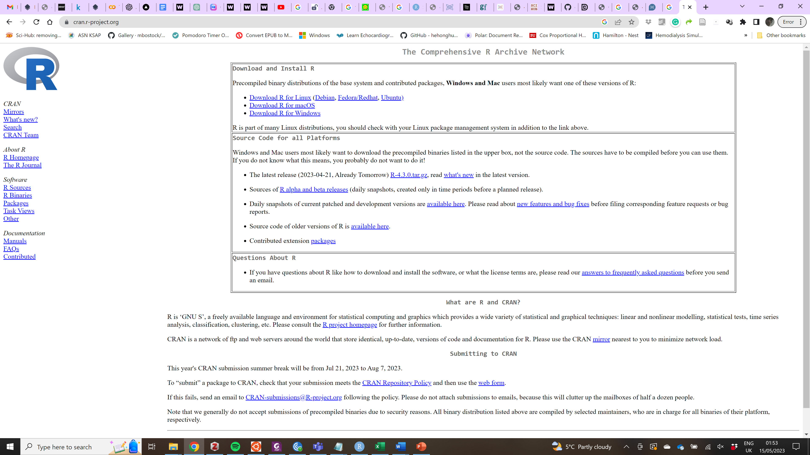
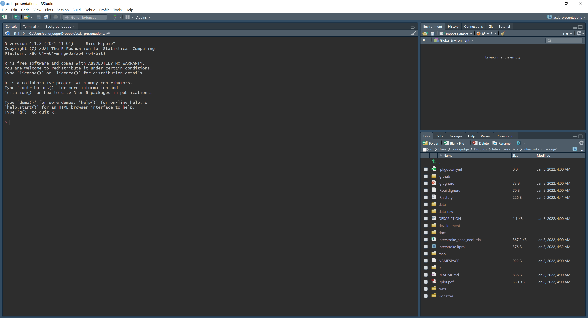
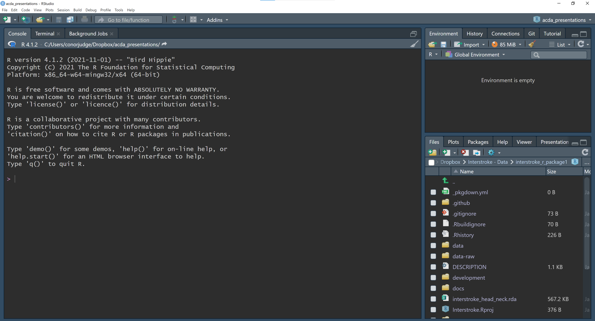
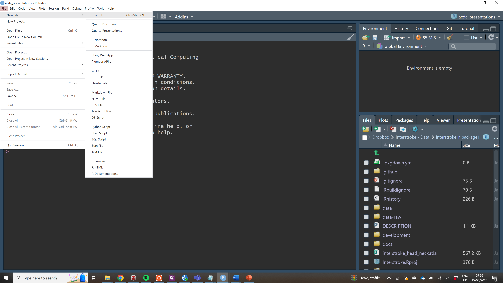

```{r setup, include=FALSE}
knitr::opts_chunk$set(echo = FALSE)
```

## CDS Resources for Week 1

- [Install R](https://cran.r-project.org/)
- [Install R Studio](https://posit.co/download/rstudio-desktop/)
- [International Stroke Trial - Data](https://static-content.springer.com/esm/art%3A10.1186%2F1745-6215-12-101/MediaObjects/13063_2010_637_MOESM1_ESM.CSV)
- [International Stroke Trial Database](https://trialsjournal.biomedcentral.com/articles/10.1186/1745-6215-12-101#Sec8)

---

## Course Overview

- Describe, Compare, Predict Framework
- What is your research question?
- PICOT
- Linking study design to research question
- Overview of study designs

---

## Describe, Compare, Predict (DCP)

- Describe
- Compare
- Predict
- Table with three columns, students fill the table with research questions

---

## What is your research question?

- Population
- Intervention
- Control
- Outcome
- Time

---

## PICOT

- Basic vs. applied research
- Quantitative vs. qualitative research
- Observational vs. experimental research

---

## Install R



---

## Introduction to RStudio

- https://swcarpentry.github.io/r-novice-gapminder/01-rstudio-intro.html

---

### Basic layout



---

### The interactive R console (entire left)



---

### Create a new R script



---

### Environment/History/Git/Connections (tabbed in upper right)

---

### Files/Plots/Packages/Help (tabbed in lower right)

---

### R Script Editor

---

### .R Files

---

### Running Code in R Studio

- Run Button
- Run Lines
- Ctrl + Return

---

### Comparing things

- 1 == 1
- 1 != 2
- 1 < 2
- 1 <= 2
- 1 > 0

---

### Variables and assignment

- x <- 1+2

---

### Variable Names

---

### R Packages

---

### Good Enough Practices for Scientific Computing

- Put each project in its own directory, which is named after the project.
- Put text documents associated with the project in the doc directory.
- Put raw data and metadata in the data directory, and files generated during cleanup and analysis in a results directory.
- Put source for the project’s scripts and programs in the src directory, and programs brought in from elsewhere or compiled locally in the bin directory.
- Name all files to reflect their content or function.

---

### Working directory

- getwd()
- setwd()

---

### Version Control

---

### R Graph Gallery

- http://r-graph-gallery.com/

---


