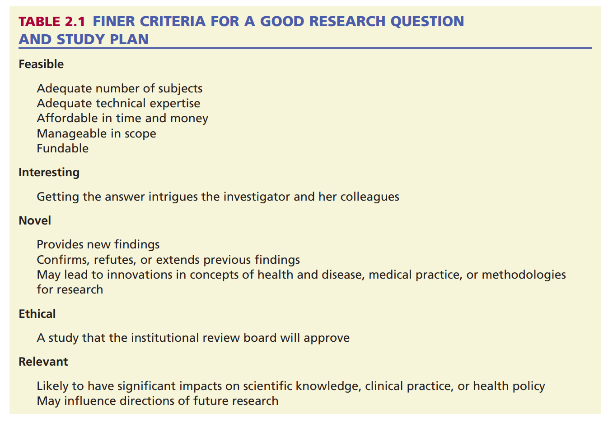

```{r setup, include=FALSE}
knitr::opts_chunk$set(echo = FALSE)
```

## HRM Resources for Week 1

- Hulley Chapter 1 - Getting Started: The Anatomy and Physiology of Clinical Research
- [Internationl Stroke Trial](https://www.rstudio.com)
- [Research Question](https://ehsanx.github.io/Scientific-Writing-for-Health-Research/research-question.html)

---

## Learning Outcomes

- LO1:
- L02:
- LO3:

---

## Course Overview

- Describe, Compare, Predict Framework
- What is your research question?
- PICOT
- Linking study design to research question
- Overview of study designs

---

## Describe, Compare, Predict (DCP)

- Definition of health research
- The importance of health research
- Examples of health research

---

## What is your research question?

- Population
- Sample
- Variable
- Data
- Hypothesis

---

## PICOT

- Basic vs. applied research
- Quantitative vs. qualitative research
- Observational vs. experimental research

---

## Slide 5: The Health Research Process

1. Identifying a research question
2. Reviewing the literature
3. Designing the study
4. Collecting data
5. Analyzing data
6. Interpreting results
7. Disseminating findings

---

## Slide 6: Introduction to Study Designs

- Definition of a study design
- Importance of choosing the right study design
- Overview of common study designs (we'll cover these in more detail in future classes)

---

## FINER Criteria



---

## Assignment

---

